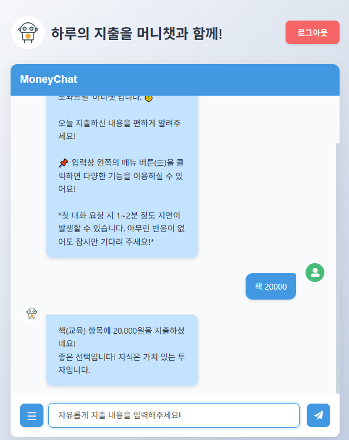
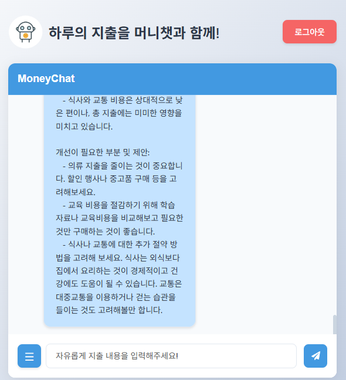

# 💰 머니챗(MoneyChat)

> 일상적인 대화로 간편하게 기록하는 AI 가계부 챗봇

자연스러운 대화를 통해 지출을 기록하고 분석해주는 AI 챗봇 서비스입니다. 복잡한 가계부 작성 대신, 채팅으로 쉽게 지출을 관리할 수 있습니다.

## 🔗 링크
- [https://moneychat-3155a.web.app/](https://moneychat-3155a.web.app/)

## 💫 화면 구성

| 로그인 | 회원가입 |
|:---:|:---:|
|||

### 메인 화면


## 📌 주요 기능

### 1. 자연어 기반 지출 입력
- 일상적인 대화처럼 자연스럽게 지출 내역 입력
- OpenAI GPT 모델을 활용한 지출 내역 자동 분류
- 직관적인 챗봇 인터페이스

### 2. 실시간 지출 분석
- 일간/주간/월간 지출 요약
- 카테고리별 지출 분석
- 맞춤형 지출 패턴 피드백

### 3. 사용자 경험 최적화
- 실시간 타이핑 인디케이터
- 반응형 디자인으로 모바일 환경 지원
- 직관적인 UI/UX

### 주요 기능 스크린샷

| 메시지 전송 | 지출 통계 |
|:---:|:---:|
|||

| 지출 피드백 1 | 지출 피드백 2 |
|:---:|:---:|
|||

## 🛠 기술 스택

### Frontend & Deploy
<div>
  
  
  
  
</div>

### Backend & Database
<div>
  
  
  
  
</div>

### API & Tools
<div>
  
  
  
</div>

## 🌟 프로젝트 특징

### 1. AI 기반 자연어 처리
- OpenAI의 GPT 모델을 활용하여 사용자의 자연스러운 대화를 분석
- 지출 내역을 자동으로 카테고리화하고 적절한 피드백 제공

### 2. 실시간 데이터 처리
- Firebase Firestore를 활용한 실시간 데이터 동기화
- 효율적인 데이터 구조 설계로 빠른 조회 성능 확보

### 3. 사용자 중심 디자인
- 모바일 퍼스트 접근으로 반응형 UI 구현
- 직관적인 인터랙션으로 사용자 경험 최적화

## 📝 회고 및 개선 사항

### 성과
- GPT API를 활용한 자연어 처리로 사용자 친화적 인터페이스 구현
- Firebase를 통한 안정적인 사용자 인증 및 데이터 관리 시스템 구축
- 실시간 타이핑 인디케이터 등 세심한 UX 요소 적용

### 향후 개선 계획
- 더 상세한 지출 분석 리포트 제공
- 예산 설정 및 알림 기능 추가
- 소셜 로그인 통합
- 데이터 시각화 강화

## 💻 설치 및 실행

```bash
# 저장소 클론
git clone https://github.com/yourusername/moneychat.git

# 프론트엔드 설정
cd moneychat-frontend
npm install

# 백엔드 설정
cd ../moneychat-backend
npm install

# 환경 변수 설정
# Frontend (.env)
REACT_APP_FIREBASE_API_KEY=your_firebase_api_key
REACT_APP_FIREBASE_AUTH_DOMAIN=your_auth_domain
REACT_APP_FIREBASE_PROJECT_ID=your_project_id
REACT_APP_FIREBASE_STORAGE_BUCKET=your_storage_bucket
REACT_APP_FIREBASE_MESSAGING_SENDER_ID=your_messaging_sender_id
REACT_APP_FIREBASE_APP_ID=your_app_id

# Backend (.env)
OPENAI_API_KEY=your_openai_api_key

# 개발 서버 실행
# Frontend
cd moneychat-frontend
npm start

# Backend
cd moneychat-backend
npm start
```

## 📦 배포 정보

### Frontend

- Firebase Hosting을 통한 정적 웹사이트 배포
- 실시간 업데이트 및 버전 관리 지원

### Backend

- Render.com을 통한 Node.js 서버 배포
- 자동 배포 및 SSL 인증서 지원
실시간 로그 모니터링 제공